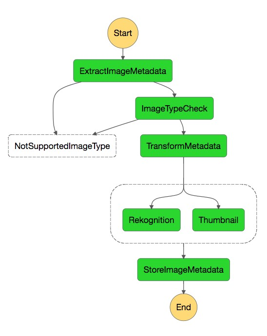

# step-functions-tester

Write unit tests for your [aws step functions](https://aws.amazon.com/step-functions/?step-functions.sort-by=item.additionalFields.postDateTime&step-functions.sort-order=desc).



## Installation

```
yarn add step-functions-tester
```

## Usage
With mocha:

```javascript 1.8
const TestRunner = require('step-functions-tester')
const { expect } = require('chai')
let testRunner
describe('Step function tester', function () {
  this.timeout('30s')

  before('Set up test runner', async function () {
    testRunner = new TestRunner()
    await testRunner.setUp()
  })
  afterEach('Clean up', async function () {
    await testRunner.cleanUp()
  })
  after('Tear down', async function () {
    await testRunner.tearDown()
  })

  it('Step function test', async function () {
    // AWS Step Function definition
    const stepFunctionDefinition = {StartAt: 'FirstStep', States: {FirstStep: { /* ... */}}}

    const stepFunctionInput = {}

    // Keys are function names in the step function definition, values are arrays of calls
    const callStubs = {'arn:eu-west:111:mockLambda': [{result: 'First call result'}, {result: 'Second call result'}], 'arn:eu-west:111:mockLambda2': [{exception: {type: 'MyError', message: 'Some exception'}}]/*... */}
    
    const { executions } = await testRunner.run(callStubs, stepFunctionDefinition, stepFunctionInput)
    expect(executions).deep.equal(expectedExecutions)
  })
})
```

## Why?
Short answer: infra is code and code should be tested.

Long answer: current AWS response is to write integration tests. However, it is often complicated to write integration tests for the error paths. Additionally, step functions are conceived to perform long running tasks. For example, to check an external resource every hour. We don't want to wait 4 hours to test what happens if the process always fails. This library allows to run tests on step functions where everything external to the step function is mocked.

## I want to use this, but my step function is defined inside a yaml file
Use [yaml-cfn](https://www.npmjs.com/package/yaml-cfn)

```
yarn add yaml-cfn
```

```javascript 1.8
const parser = require('yaml-cfn')
const file = fs.readFileSync('yourPath.yml')
const parsedYaml = parser.yamlParse(file.toString())
const definition = parsedYaml.Resources/** Navigate to your definition **/

```

## How is the sausage made?

Amazon exposes a docker image to run step functions locally `amazon/aws-stepfunctions-local` additionally using sam it is possible to run lambdas locally.

We save the stubs for your lambda functions in redis and return those to the current execution from a fake lambda.


## Requirements

```
## important different versions, even patches can make the tester not run
pip3 install 'aws-sam-cli==1.23.0'
pip3 install docker-compose==1.25.4
```

Linux.


## Gotchas
* No current support for parallel.
* Current implementation is quite global and it will run docker on the host network and use default redis port.
* Not currently working on Mac, PRs are welcome 
